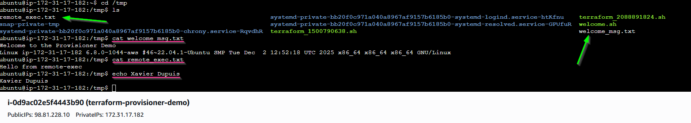

# Terraform EC2 Provisioner Demo

This project demonstrates how to use **Terraform** to provision an **AWS
EC2 Ubuntu instance** and apply **provisioners** (`remote-exec` and
`file`) for basic bootstrapping and configuration.

It is intended for **learning and demonstration purposes**, especially
to understand how Terraform provisioners work and when to use them.

------------------------------------------------------------------------

## What This Project Does

-   Uses an **S3 backend** to store Terraform state
-   Dynamically looks up the **latest Ubuntu 22.04 (Jammy) AMI**
-   Creates:
    -   An EC2 instance
    -   A security group allowing SSH (port 22)
-   Demonstrates two Terraform provisioner patterns:
    1.  `remote-exec`
    2.  `file` + `remote-exec`
-   Outputs the instance ID and public IP address

------------------------------------------------------------------------

## Architecture Overview

-   **AWS Provider**: `hashicorp/aws`
-   **Region**: `us-east-1` (default)
-   **Instance Type**: `t3.micro` (default)
-   **OS**: Ubuntu 22.04 LTS
-   **State Storage**: S3 backend

------------------------------------------------------------------------

## Prerequisites

Before you begin, ensure you have:

-   An AWS account
-   An existing **S3 bucket** for Terraform state
    -   Example bucket name used in this project:

            mybucketconfig519
-   An existing **EC2 Key Pair** in your chosen AWS region
-   Terraform **v1.3+** installed
-   AWS credentials configured locally (`aws configure` or environment
    variables)
-   SSH access from your IP address

------------------------------------------------------------------------

## Project Structure

    .
     TerraformCode
     ├── main.tf
     ├── variables.tf
     ├── providers.tf
     ├── outputs.tf
     ├── backend.tf
     ├── scripts/
     │   └── welcome.sh
    └── README.md

------------------------------------------------------------------------

## Terraform Backend (S3)

The Terraform state is stored remotely using an S3 backend.

``` hcl
terraform {
  backend "s3" {
    bucket = "mybucketconfig519"
    key    = "terraform.tfstate"
    region = "us-east-1"
  }
}
```

> ⚠️ The S3 bucket **must already exist** before running
> `terraform init`.

------------------------------------------------------------------------

## Provisioners Explained

### 1. `remote-exec` Provisioner

Runs commands on the EC2 instance over SSH.

Example actions: - Updates package lists - Writes a test file to
`/tmp/remote_exec.txt`

``` hcl
provisioner "remote-exec" {
  inline = [
    "sudo apt-get update",
    "echo 'Hello from remote-exec' | sudo tee /tmp/remote_exec.txt"
  ]
}
```

### 2. `file` + `remote-exec` Provisioner

Copies a script from your local machine to the instance and executes it.

-   Script copied: `scripts/welcome.sh`
-   Output written to: `/tmp/welcome_msg.txt`

``` hcl
provisioner "file" {
  source      = "${path.module}/scripts/welcome.sh"
  destination = "/tmp/welcome.sh"
}
```

``` hcl
provisioner "remote-exec" {
  inline = [
    "sudo chmod +x /tmp/welcome.sh",
    "sudo /tmp/welcome.sh"
  ]
}
```

------------------------------------------------------------------------

## Script: `welcome.sh`

``` bash
#!/bin/bash
set -e

echo "Welcome to the Provisioner Demo" | sudo tee /tmp/welcome_msg.txt
uname -a | sudo tee -a /tmp/welcome_msg.txt
cat /tmp/welcome_msg.txt
```

------------------------------------------------------------------------

## Variables

  Variable             Description                  Default
  -------------------- ---------------------------- --------------
  `region`             AWS region                   `us-east-1`
  `instance_type`      EC2 instance type            `t3.micro`
  `key_name`           Existing EC2 key pair name   **Required**
  `private_key_path`   Path to SSH private key      **Required**
  `ssh_user`           SSH username                 `ubuntu`

------------------------------------------------------------------------

## Usage

### 1. Initialize Terraform

``` bash
terraform init
```

### 2. Plan the Deployment

``` bash
terraform plan \
  -var="key_name=your-keypair-name" \
  -var="private_key_path=~/.ssh/your-key.pem"
```

### 3. Apply

``` bash
terraform apply
```

------------------------------------------------------------------------

## Outputs

After a successful apply, Terraform will output:

-   **Instance ID**
-   **Public IP Address**

Use the public IP to SSH into the instance:

``` bash
ssh -i ~/.ssh/your-key.pem ubuntu@<PUBLIC_IP>
```

This is what you should be able to see:




------------------------------------------------------------------------

## Important Notes on Provisioners

-   Provisioners are **not recommended for production**
-   They are best used for:
    -   Demos
    -   Learning
    -   Temporary bootstrapping
-   For production workloads, consider:
    -   Cloud-init
    -   AMI baking (Packer)
    -   Configuration management tools (Ansible, Chef, etc.)

------------------------------------------------------------------------

## Cleanup

To destroy all resources:

``` bash
terraform destroy
```

------------------------------------------------------------------------

## References

- Terraform Registry
- Tech Tutorials with Piyush (day 19/30)
- Terraform AWS Provider Documentation

## 👤 Author

**Xavier Dupuis**

